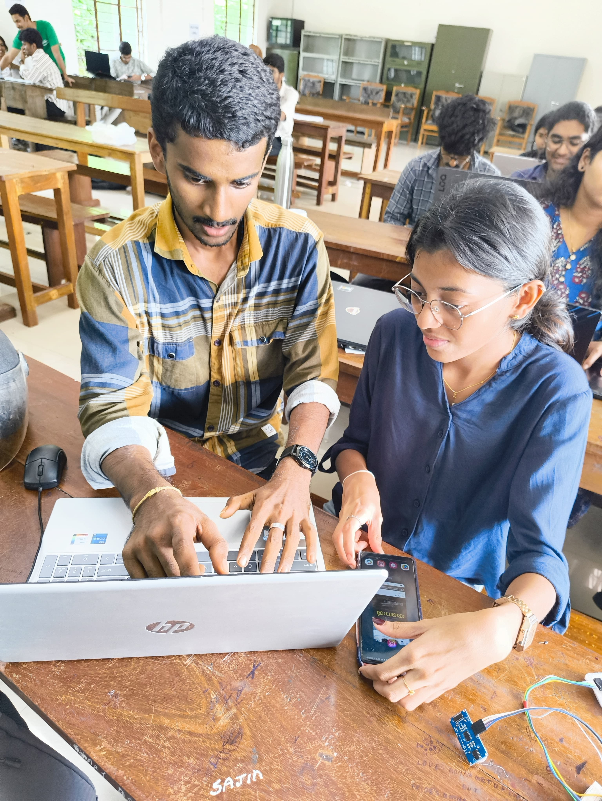

Project name: Jawline adich poyi... 🎯

Basic Details
Team Name: ALEXANDREAN PHALANX

Team Members
Team Lead: Sanjeev Santhosh – College of Engineering Kallooppara
Member 2: Neya Sabu – College of Engineering Kallooppara

Project Description
Jawline Adich Poyi is an IoT-based system that tracks a cow’s chewing using an MPU6050 sensor on an ESP32 and detects nearby humans with an HC-SR04 ultrasonic sensor. The data is sent to Firebase and displayed on a fun, animated web dashboard that shows the cow’s mood, plays videos, and updates live chewing stats

The Problem (that doesn't exist)
Nobody hears what a cow says when we go near it… and nobody knows its mood while chewing.

The Solution (that nobody asked for)
We attached motion and distance sensors to the cow’s head, tracked chewing patterns, streamed data to Firebase, and made a fun website to announce the cow’s mood and play cheeky videos when you approach.

Technical Details
Technologies/Components Used
For Software:
Languages: C++ (Arduino), HTML, CSS, JavaScript
Libraries: FirebaseESP32, Wire.h, Chart.js, GSAP.js
Tools: Arduino IDE, Firebase Console, Browser DevTools

For Hardware:

Components: ESP32, MPU6050, HC-SR04 Ultrasonic Sensor
Specifications: MPU6050 (3-axis accel + gyro), HC-SR04 range 2–400 cm, ESP32 WiFi-enabled
Tools: Breadboard, jumper wires, USB cable

Implementation
For Software:

Installation
git clone https://github.com/username/jawline-adich-poyi.git

Run
# Open index.html in your browser

Project Documentation
For Software:

Screenshots (Add at least 3)
 Add caption explaining what this shows

 Add caption explaining what this shows

 we just forget to take screenshot of that while running.....but uploading the picture of present graph(the hardware components are distributed among its owners)

Diagrams
Data flow: Sensors → ESP32 → Firebase → Web Dashboard.
Sensors capture chewing & motion → ESP32 processes & sends to Firebase → Web dashboard displays mood, videos, and stats in real time.

For Hardware:

Schematic & Circuit
MPU6050
VCC → 3.3V
GND → GND
SDA → GPIO 21 (SDA)
SCL → GPIO 22 (SCL)

HC-SR04 Ultrasonic
VCC → 5V (or 3.3V if you prefer; 5V gives best range)
GND → GND
TRIG → GPIO 33 (digital out from ESP32)
ECHO → Voltage divider → GPIO 32 (digital input to ESP32)

Voltage divider for ECHO (if HC-SR04 powered at 5V)
Convert ECHO 5V → 3.3V safe for ESP32:

ECHO output → R1 = 2.2kΩ → node → R2 = 3.3kΩ → GND
(Take the node between R1 and R2 to ESP32 GPIO32).
— This divides ~5V down to ~3.0–3.2V which is safe for ESP32 input.
Alternatively use R1 = 1.8kΩ and R2 = 3.3kΩ (≈3.3V at node).

 connected each sensors with esp32 using this
 connected sensors in breadboard

 
Build Photos
MPU6050 module (GND / VCC / SDA / SCL)
HC-SR04 ultrasonic sensor
Resistors for voltage divider (2.2kΩ and 3.3kΩ) or a proper bidirectional level shifter
Breadboard, jumper wires, USB cable, power supply (5V if using HC-SR04 at 5V)

 

 

 

Project Demo
Video
[explanation video](vids/finalvideo2.mp4) Explain what the video demonstrates

Additional Demos
[screenrecord](vids/screenrecord1.mp4)

Team Contributions
Sanjeev Santhosh – Arduino programming, Firebase integration, hardware setup.
Neya Sabu – Web dashboard design, frontend animations, chart integration.
Both members contributed equally to all aspects of the project.
